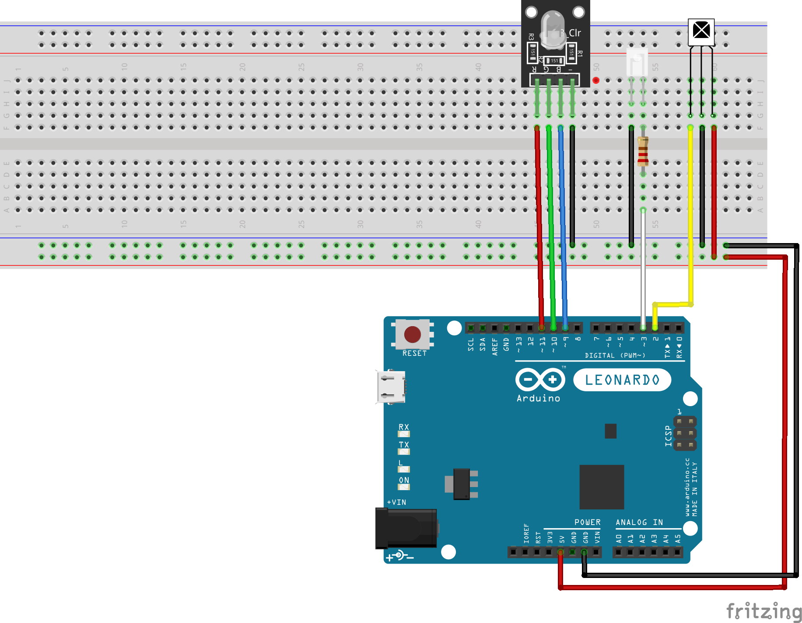

# Laser X shoot-back

This is a small Arduino-based project that interacts with a Laser X toy gun.
When shot at, the device will blink a LED of the color of the player who shot,
then it will shoot back at all players (of any color) and then keep shooting at
random intervals.

## Hardware

* Arduino (tested with Arduino Leonardo)
* Infrared receiver
* Infrared LED
* RGB LED

## Wiring

Alternatively, see [Fritzing file](laserx-shoot-back.fzz).

## Libraries

* [Arduino-IRremote](https://www.arduino.cc/reference/en/libraries/irremote/)
* [RGB](https://www.arduino.cc/reference/en/libraries/rgb/)

## Contributing

Contributions in the form of ideas or pull requests are welcome.

## Credits

The [Laser-X-Hacks](https://github.com/illuminateddan/Laser-X-Hacks) projects
was helpful in getting started.

## License

See [LICENSE](LICENSE).
